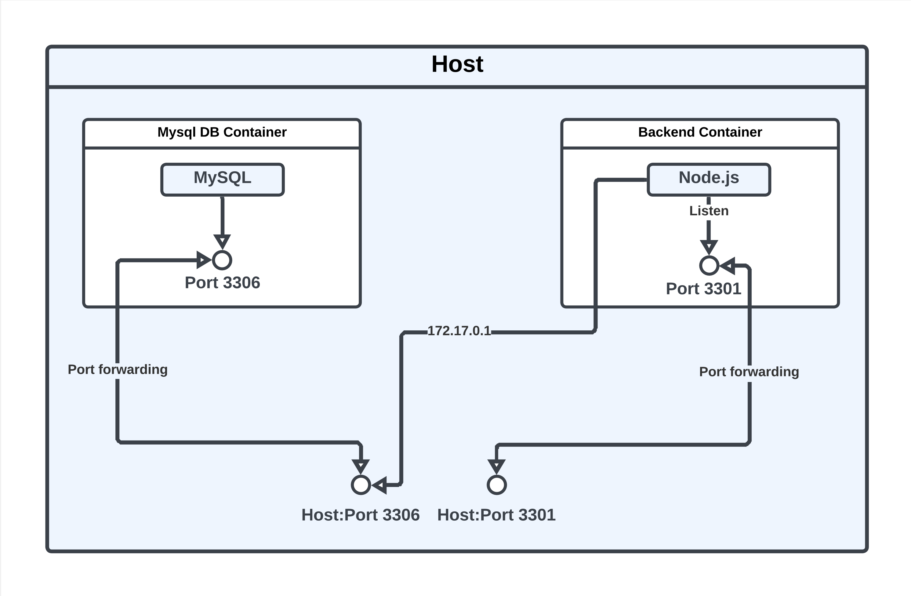

# Noteworthy-backend

The Node.js backend for the Noteworthy app.

## Table of Contents
1. [Architecture Diagram](#architecture-diagram)
2. [Tech Stack / Libraries](#tech-stack--libraries)
3. [Endpoints (/api/v1/)](#endpoints-apiv1)
4. [Building and Running the App](#building-and-running-the-app)

## Architecture Diagram

## Tech Stack / Libraries
- [Node.js](https://nodejs.org/en)
- [Express.js](https://expressjs.com)
- [TypeScript](https://www.typescriptlang.org)
- [Jest (ts-jest)](https://www.npmjs.com/package/ts-jest)
- [DotEnv](https://www.npmjs.com/package/dotenv)
- [Helmet.js](https://helmetjs.github.io)
- [Bcrypt](https://www.npmjs.com/package/bcrypt)
- [Cors](https://www.npmjs.com/package/cors?activeTab=readme)
- [Mysql2](https://www.npmjs.com/package/mysql2)
- [Docker](https://www.docker.com)
- [Docker Compose](https://docs.docker.com/compose/)

## Endpoints (/api/v1/)
### 🟢 Auth
<table>
  <thead>
    <tr>
      <th>Endpoint</th>
      <th>Method</th>
      <th>Description</th>
      <th>Request Body</th>
    </tr>
  </thead>
  <tbody>
    <tr>
      <td>/auth/register</td>
      <td>POST</td>
      <td>Registers a new user.</td>
      <td>JSON containing email and password.</td>
    </tr>
    <tr>
      <td>/auth/login</td>
      <td>POST</td>
      <td>Logs in an existing user.</td>
      <td>JSON containing email and password.</td>
    </tr>
  </tbody>
</table>

### 🟢 Notes
<table>
  <tbody>
    <tr>
      <td>/notes/new</td>
      <td>POST</td>
      <td>Creates a new note for the authenticated user.</td>
      <td>JSON containing note details.</td>
    </tr>
    <tr>
      <td>/notes/all</td>
      <td>GET</td>
      <td>Fetches all notes of a user.</td>
      <td>N/A - User ID as query parameter.</td>
    </tr>
    <tr>
      <td>/notes/update</td>
      <td>PUT</td>
      <td>Updates a specific note by ID for the authenticated user.</td>
      <td>JSON containing updated note details.</td>
    </tr>
    <tr>
      <td>notes/delete</td>
      <td>DELETE</td>
      <td>Deletes a specific note by ID for the authenticated user.</td>
      <td>N/A - Note ID as query parameter.</td>
    </tr>
  </tbody>
</table>

## Building and Running the App

### ⚙️ Manually running the containers

#### Running the database container:  
- Ensure Docker is installed and running.
- Build a Docker image of the MySQL container based on the `DockerFile` in `backend-db-docker/`.
- While running the image ensure that port `3306` is forwarded using the flag `-p 3306:3306`
  and also set the environment variable `MYSQL_ALLOW_EMPTY_PASSWORD` to true using the
  following flag `-e MYSQL_ALLOW_EMPTY_PASSWORD=true` while running a container based on the image.
  the container

#### Running the Node.js / backend container
- Ensure that the database container is already running.
- Build and run a Docker container based on the `DockerFile` at the root of the project ensuring that
  the port `3001` is forwarded using the flag `-p 3301:3301`.
- The server will be running on http://localhost:3001.

### 🦸‍♂️ Running the containers using docker-compose
- Go to the root directory of the project where the `docker-compose.yaml` file is located.
- Run the following command `docker-compose up` from the terminal.
- The server will be running on http://localhost:3001 and the database will be running on http://localhost:3306.
  
